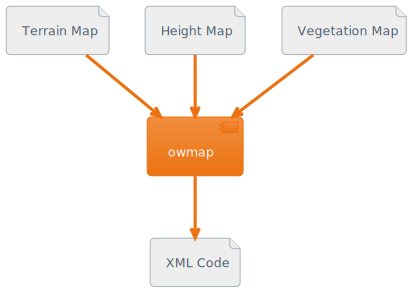

# Old World Mapmaker
This is an unofficial XML generator that converts 3 RGB bitmaps to a map for the game [Old World](https://en.wikipedia.org/wiki/Old_World_(video_game)) by [Mohawk Games](https://en.wikipedia.org/wiki/Mohawk_Games). I thought it was amazing the maps were all just in plain XML and wanted a lighter-weight way to make maps outside of the in-game editor, so I made this. The main use-case for this is to make a map first as a bitmap in an image editor like GIMP or Photoshop, then use this to transform your layers into XML.  

### Installation
This has been rolled into a python package and CLI application. Distribution on PyPI is planned but I would like to get it more thoroughly tested before that. For now you can either build from source or install from the current wheel in the distributions pane. You can install to your user python or system-wide, but running inside a [virtual environment](https://docs.python.org/3/library/venv.html) as a best practice. 

From wherever you installed the wheel to, and with the virtual environment activated if you went that route:

`pip install owmap-0.1.0-py3-none-any.whl`

After that you should be able to use the cli application or the `genmap` library in a python script. To set up a development environment I suggest using uv. After cloning the repository sync with the all dependency groups: 

`uv sync --all-groups`


I couldn't get `uv run pytest` to work. For some reason that uses the default python interpreter instead of your virtual environment. This does work though:

`uv run python -m pytest /tests`

I have also created an up-to-date `requirements.txt` if that's what you're used to. As a reminder:

1. from the repositories root directory after cloning: `python -m venv .venv`
2. `source .venv/bin/activate`
3. `pip install -r requirements.txt`

Or on windows using powershell

1. from the repositories root directory after cloning: `python -m venv .venv`
2. `source .venv/Scripts/Activate.ps1`
3. `pip install -r requirements.txt`

### CLI Basic usage



```
owmap [-h] [--mapname MAPNAME] [--terrainmap TERRAINMAP]
             [--heightmap HEIGHTMAP] [--vegmap VEGMAP]
             [maps ...]
```

At its most basic, the cli tool can take 3 positional arguments like so: 

`owmap [heightmap] [terrainmap] [vegmap] `

Each of these maps represents a different layer of Old World's tile system. All of these maps are required to build a proper world. The tool can also be run with flags instead of positional arguments, for example:

`owmap --terrainmap docs/terrain_ex.png --heightmap docs/height_ex.png --vegmap docs/veg_ex.png --mapname docs/donut.xml`

or more succinctly:

`owmap -t docs/terrain_ex.png -e docs/height_ex.png -v docs/veg_ex.png -o docs/donut.xml`

The order doesn't matter for flags. 
