# Example Usage of the Old-World Mapmaker

The best workflow is to do the maps is in this order: `heightmap -> terrainmap -> vegmap`

I'll be trying a different order to better show off different ways of going about map-creation in an image-editor.

After installing the tool (and acivating your virtual environment if you chose to install it that way) you'll want to start off with your maps. You will need three blank bitmaps or PNG images of the same size, make sure to make them 8-bit RGB. I'm using GIMP here to make a 100x100 pixel image. 

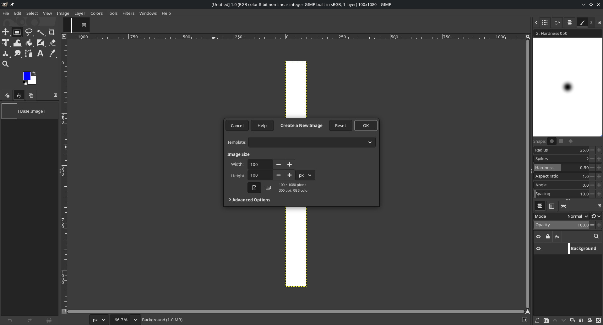

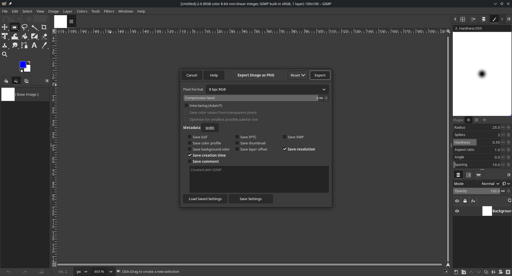

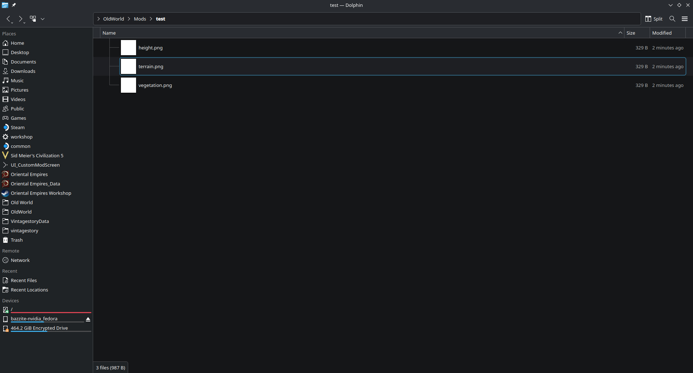

<br><br>

Duplicating that one, we should now have three blank images to work with. Although before we get to work we need to know the what RGB values map to what tile-types, and for that we can use the `--genpalettes` flag. Open a terminal in your project's directory and use the command: 

`owmap --genpalettes`

<br>
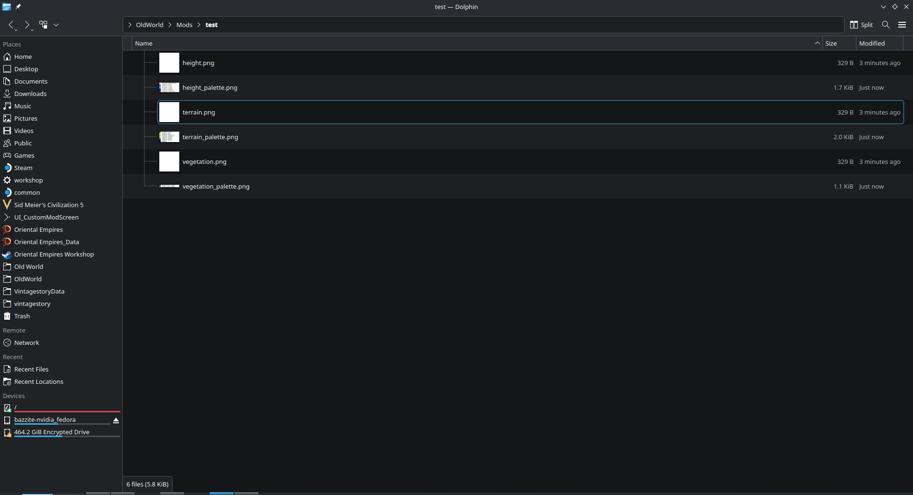
<br>

We now have everything we need to get started in an image-editor of your choice, I recommend one that can stack images as layers on top of each other. I will just be using GIMP here again, opening the three images I created as layers.

<br>

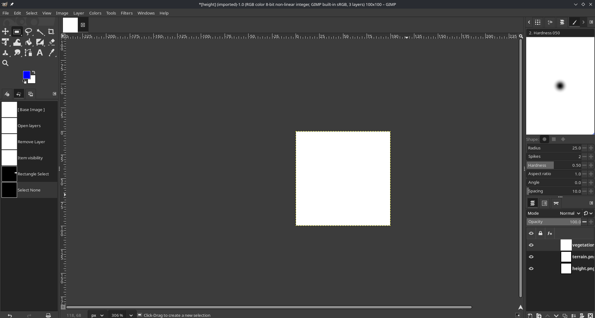

<br>

For convenience we also need the palettes here so we can use the color-picker to get the tile-type e want. We can either add the palettes as layers and merge them into their respective maps, or we can just open them in another tab within GIMP. I'll do both next, lets draw a happy little bush with the pencil tool so our RGB values stay exact.

<br>

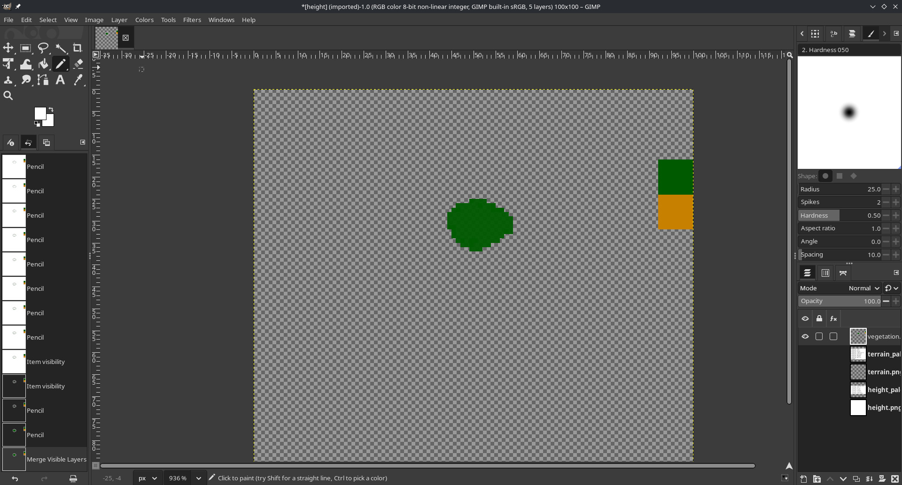

<br>

Next lets make the vegetation map's background transparent* so that we can easily overlay it over the other maps. For our terrain-map we'll just make a simple island with arid terrain. 

<br>

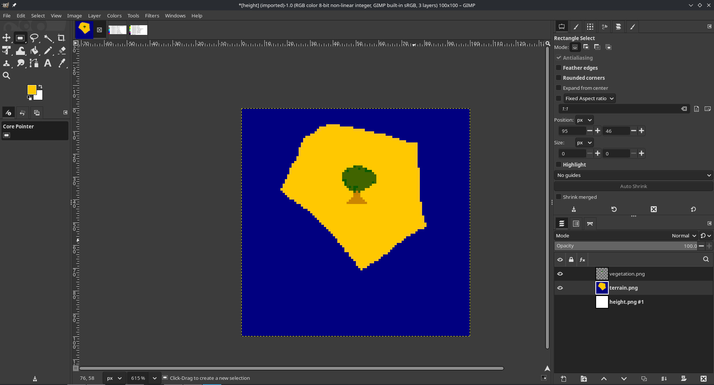

<br>

Next we'll do the heightmap. I will make the terrain-map slightly transparent so that I can maintain the proper boundery between sea and land for the height values.

<br>

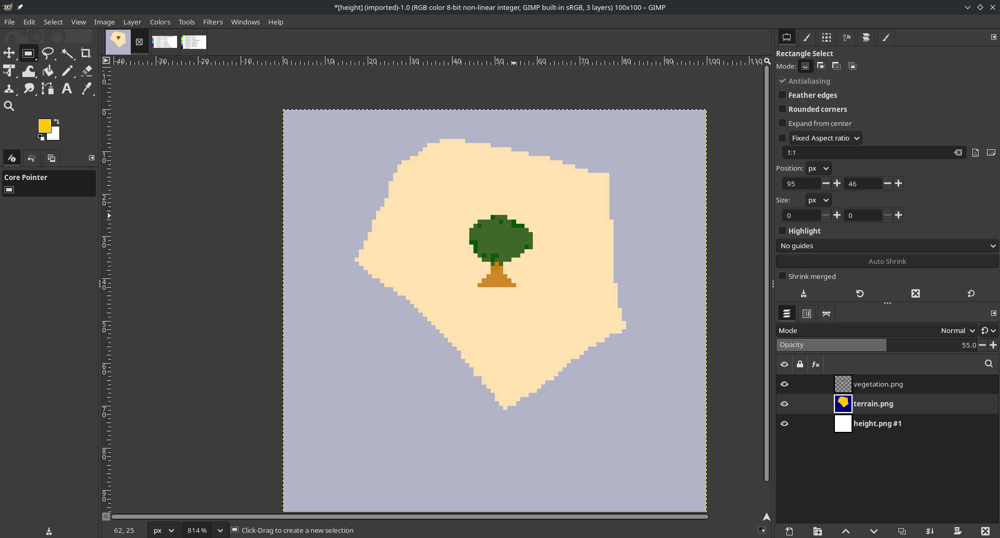

<br>

Here I select the terrain-layer, use the fuzzy-select tool on the arid terrain on the island, then switch back to the height-layer. I can then fill that selection with the bucket-fill tool.

<br>

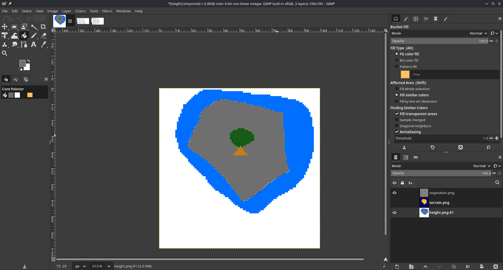

<br>

With the images done we can export each of the layers by simply making only one visible and *File->Export As* for each layer. **Export them with 8-bit RGB pixel-format**.

The resulting maps:

<br>

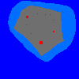

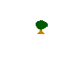

<br>

We then use the tool: `owmap height.jpg terrain.jpg vegetation.jpg`, yielding `newmap.xml`

<br>

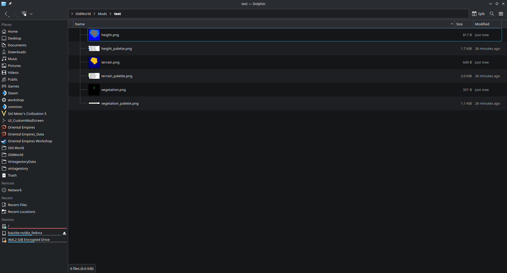

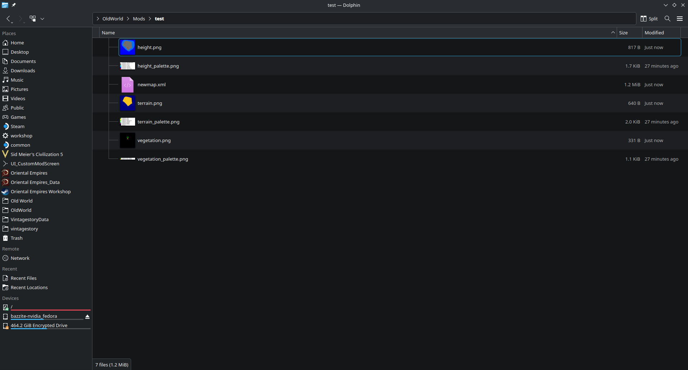

<br>

Right now map data just gets dumped on one line, but pretty-printed it should look something like this:

```xml
<?xml version='1.0' encoding='utf-8'?>
<Root MapWidth="100" MapHeight="100" MapEdgesSafe="False">
    <Tile ID="0">
        <Terrain>TERRAIN_WATER</Terrain>
        <Height>HEIGHT_OCEAN</Height>
    </Tile>
    <Tile ID="1">
        <Terrain>TERRAIN_WATER</Terrain>
        <Height>HEIGHT_OCEAN</Height>
    </Tile>
    <Tile ID="2">
        <Terrain>TERRAIN_WATER</Terrain>
        <Height>HEIGHT_OCEAN</Height>
    </Tile>
    <Tile ID="3">
        <Terrain>TERRAIN_WATER</Terrain>
        <Height>HEIGHT_OCEAN</Height>
    </Tile>

    ...

```
<br>

Placing it in the `OldWorld/Maps/` directory, then loading it up with the in-game map editor, we can now see our happy little bush

<br>

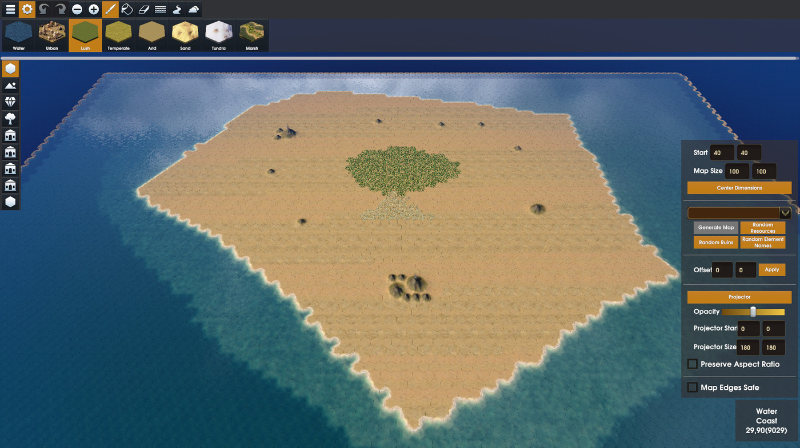


---
\* The transparent background defaults to black when exporting, and right now the threshhold for `owmap` is too broad so it will interpret black as trees. Change the background of the vegmap to white at the end.  